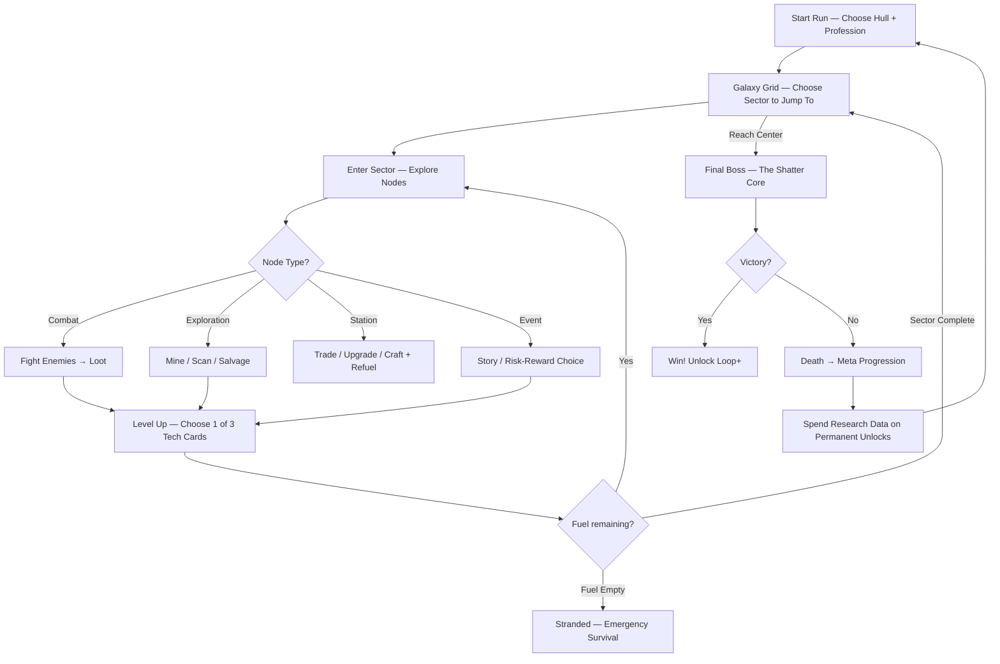

# ⚙️ Core Mechanics Design

> **Parent doc:** [00_GAME_DEVELOPMENT_PLAN.md](../00_GAME_DEVELOPMENT_PLAN.md)

---

## 1. Gameplay Loop



---

## 2. Galaxy Grid & Navigation

The run takes place on a **2D hex grid of sectors** — players start at the outer edge and navigate toward **The Shatter Core** at the center. Each run is a unique galaxy layout.

```
    [Empty] [Nebula]  [Empty]  [Pirate]  [Empty]
  [Asteroid] [Station] [Debris] [Empty] [Ice Field]
    [Gas Giant] [Empty] [★ CORE ★] [Empty] [Alien]
  [Empty] [Battle] [Station] [Supernova] [Empty]
    [Asteroid] [Empty] [Nebula] [Empty] [Derelict]
                                            ↑ YOU START HERE
```

| Navigation Mechanic | Details                                                                                                 |
| ------------------- | ------------------------------------------------------------------------------------------------------- |
| **Jump Range**      | Each hull has a jump range (1–3 sectors). Jump to any sector within range on the grid                   |
| **Warp Crystals**   | Jumping costs Warp Crystals. Cost **scales per ring** — closer to center = exponentially more expensive |
| **Route Planning**  | Beeline to center = cheaper jumps but fewer upgrades. Detour = more loot but may not afford later jumps |
| **Sector Reveal**   | Only adjacent sectors are visible. Scout profession reveals 2-hop radius                                |
| **Co-op Jump**      | Team votes on destination. Longest jump range in party is used. Warp Crystal cost is shared             |

### Warp Crystal Jump Costs (Scaling)

| Ring           | Distance from Center | Warp Crystal Cost | What This Means                                     |
| -------------- | -------------------- | ----------------- | --------------------------------------------------- |
| **Outer Ring** | 4–5 sectors out      | 3 crystals        | Easy — a couple of asteroid nodes fund the jump     |
| **Mid Ring**   | 2–3 sectors out      | 8 crystals        | Moderate — need to clear most of a sector to afford |
| **Inner Ring** | 1 sector out         | 18 crystals       | Hard — need efficient farming or trading            |
| **The Core**   | Center               | 30 crystals       | Final gate — you must be fully powered to enter     |

> **The core tension:** If you aren't scaling your power/income fast enough, you literally can't afford to reach the center. Visiting extra sectors for loot is tempting, but each _additional_ jump also costs crystals — so detours compound the cost. Faster hulls (Phantom jump range 3) can skip cheap outer sectors to save crystals for the expensive inner ring.

> **Profession synergies with Warp Crystals:**
>
> - **Miner** earns bonus crystals from asteroid mining nodes
> - **Hauler** can carry surplus crystals and trade minerals → crystals at stations
> - **Scout** reveals sector types, helping plan the cheapest route to center
> - **Scientist** can find Warp Crystal synthesis recipes at tech labs

---

## 3. Sector Generation (Environment × Encounter)

Each sector on the galaxy grid is generated from **two independent rolls**: an **Environment** (where you are) and an **Encounter Type** (what you're doing). This creates massive variety — an Asteroid Field + Pirate Raid plays completely differently from an Asteroid Field + Mining Race, even though you're in the same environment.

### Axis 1: Environments (the setting + passive hazard)

Environments determine the **visual theme, environmental hazards, and ambient resources.** They are the "where."

| Rarity       | Environment              | Visual Theme                        | Passive Hazard                            | Ambient Resources            |
| ------------ | ------------------------ | ----------------------------------- | ----------------------------------------- | ---------------------------- |
| 🟢 Common    | ⛏️ **Asteroid Field**    | Dense floating rocks, crystal veins | Asteroid debris rains down                | Mineral nodes, crystal veins |
| 🟢 Common    | 🌫️ **Nebula**            | Colorful gas clouds, low visibility | Ion storms degrade shields                | Hidden signal caches         |
| 🟢 Common    | 💥 **Debris Field**      | Destroyed fleet wreckage            | Unstable hulls can explode                | Floating cargo, salvage      |
| 🟢 Common    | 🌑 **Open Space**        | Clear starfield, sparse             | None — calm, fast traversal               | Drifting containers          |
| 🟡 Uncommon  | 🧊 **Ice Field**         | Frozen derelicts, comet tails       | Systems slow down, weapons charge slower  | Comet mining, cryo-pods      |
| 🟡 Uncommon  | 🌊 **Gas Giant Rings**   | Swirling gas, orbital ring debris   | Gravitational pulls, lightning            | Gas harvesting nodes         |
| 🟠 Rare      | 🌋 **Supernova Remnant** | Intense radiation, dying star       | **⚠️ SUPERNOVA TIMER** — sector EXPLODES! | Rich mineral deposits        |
| 🟣 Legendary | 🕳️ **Void Rift**         | Reality-warped, impossible geometry | Physics glitch, gravity reverses          | Void-tier resource nodes     |

> Environments are rolled based on rarity weights. Most sectors are Common; 0–1 per grid will be Legendary.

### Axis 2: Encounter Types (the objective + exit condition)

Encounter types determine **what you're doing in this sector and how you complete/exit it.** They are the "what."

| Encounter Type          | Objective                                                  | Exit Condition                                           | Reward Focus                 |
| ----------------------- | ---------------------------------------------------------- | -------------------------------------------------------- | ---------------------------- |
| ⚔️ **Clear & Conquer**  | Eliminate all enemy waves                                  | All enemies destroyed                                    | Weapons, Power Cores         |
| ⛏️ **Mining Run**       | Mine X resources before time/hazard escalates              | Hit resource quota OR choose to leave early              | Minerals, Warp Crystals      |
| 🏴‍☠️ **Pirate Raid**      | Survive waves of pirate attackers while defending position | Survive until pirates retreat OR destroy pirate flagship | Contraband, rare weapons     |
| 🔬 **Research Mission** | Scan anomalies, collect data, solve puzzles                | Complete all scan objectives                             | Research Data, Tech Cards    |
| 🏃 **Escape Run**       | Get to the exit point before timer expires                 | Reach the warp gate in time                              | Bonus Warp Crystals          |
| 🛡️ **Defense**          | Protect an objective (station, convoy, ally ship)          | Objective survives all waves                             | Ally rewards, unique modules |
| 💀 **Boss Fight**       | Defeat a sector boss                                       | Boss is dead                                             | Epic/Legendary loot, big XP  |
| 🎲 **Event**            | Story encounter — choices, NPCs, risk/reward               | Make choices, deal with consequences                     | Varies wildly                |

### Environment × Encounter Compatibility Matrix

Not every encounter works in every environment. The ✅ marks valid combos (50+ total). The ⭐ marks **signature combos** that have special flavor:

|                          | ⚔️ Clear | ⛏️ Mining | 🏴‍☠️ Raid | 🔬 Research | 🏃 Escape | 🛡️ Defense | 💀 Boss | 🎲 Event |
| ------------------------ | -------- | --------- | ------- | ----------- | --------- | ---------- | ------- | -------- |
| ⛏️ **Asteroid Field**    | ✅       | ⭐        | ✅      | ✅          | ✅        | ✅         | ✅      | ✅       |
| 🌫️ **Nebula**            | ✅       | ✅        | ✅      | ⭐          | ✅        | ✅         | ✅      | ✅       |
| 💥 **Debris Field**      | ✅       | ✅        | ⭐      | ✅          | ✅        | ✅         | ✅      | ✅       |
| 🌑 **Open Space**        | ✅       | —         | ✅      | —           | ✅        | ✅         | ✅      | ✅       |
| 🧊 **Ice Field**         | ✅       | ✅        | ✅      | ⭐          | ✅        | ✅         | ✅      | ✅       |
| 🌊 **Gas Giant Rings**   | ✅       | ⭐        | ✅      | ✅          | ⭐        | ✅         | ✅      | ✅       |
| 🌋 **Supernova Remnant** | —        | ⭐        | —       | ⭐          | ⭐        | —          | ✅      | —        |
| 🕳️ **Void Rift**         | ✅       | —         | —       | ⭐          | ✅        | —          | ⭐      | ✅       |

> **Signature combos (⭐)** have unique flavor text, special mechanics, or bonus rewards. For example:
>
> - **Supernova + Mining Run** = "Smash and Grab" — mine as much as you can before the star explodes
> - **Supernova + Escape Run** = "Outrun the Blast" — race to the warp gate through radiation
> - **Debris Field + Pirate Raid** = "Ambush Alley" — pirates use wreckage as cover
> - **Void Rift + Boss Fight** = "Reality Breaker" — boss uses the warped physics as weapon
> - **Nebula + Research Mission** = "Into the Fog" — follow signal pings through zero-visibility gas

---

## 4. Boss Encounter Design

Bosses ONLY appear in **💀 Boss Fight** encounter types. Not every sector has one — expect **2–3 boss sectors per run** plus the final Shatter Core.

### Ring-Scaled Boss Roster

| Ring      | Boss                     | Environment               | Mechanic                                                                       | Loot                                            |
| --------- | ------------------------ | ------------------------- | ------------------------------------------------------------------------------ | ----------------------------------------------- |
| **Outer** | **Pirate Warlord**       | Debris Field / Asteroid   | Calls in reinforcement waves; destroy supply ships to stop reinforcements      | Rare weapon + contraband stash                  |
| **Outer** | **Hive Queen**           | Nebula / Asteroid         | Spawns drone swarms; target egg sacs to thin the herd                          | Drone modules (Carrier synergy)                 |
| **Mid**   | **Void Stalker**         | Any dark environment      | Cloaks and ambushes; you track it via sonar pings in reduced visibility        | Stealth tech (Phantom synergy)                  |
| **Mid**   | **Rogue AI Dreadnought** | Debris Field / Open Space | Multi-phase: disable shields → board interior → destroy core                   | Military modules + epic weapons                 |
| **Inner** | **Supernova Guardian**   | Supernova Remnant         | Fights inside the timer — you're racing both the boss AND the explosion        | Legendary drops if you beat it before the timer |
| **Inner** | **Alien Architect**      | Void Rift / Ice Field     | Manipulates the environment — builds walls, creates gravity wells, warps space | Alien tech cards, void-tier loot                |

### Boss Design Philosophy

| Principle         | Details                                                                                                                             |
| ----------------- | ----------------------------------------------------------------------------------------------------------------------------------- |
| **Multi-Phase**   | Every boss has 2–3 phases with distinct mechanics, not just more HP                                                                 |
| **Arena Hazards** | The environment IS part of the fight — asteroids, radiation, gravity                                                                |
| **Role Moments**  | Each profession has a key moment during the fight (Scientist exposes weakness, Miner breaks armor, Scout reveals hidden weak point) |
| **Co-op Scaling** | More players = boss gets additional attack patterns, not just more HP                                                               |
| **Loot Piñata**   | Bosses explode into loot like a piñata — the most satisfying moment in the run                                                      |

### 🌀 The Shatter Core — Final Boss

The center of the galaxy. The reason the galaxy shattered.

| Phase                      | Name                 | Mechanic                                                                                                                                                           |
| -------------------------- | -------------------- | ------------------------------------------------------------------------------------------------------------------------------------------------------------------ |
| **Phase 1**                | "The Approach"       | Navigate through collapsing reality while fighting guardian ships. The arena itself shifts and rotates                                                             |
| **Phase 2**                | "The Shatter Entity" | The core manifests — massive entity uses gravity beams, reality tears, and void projectiles. Environment fragments break apart and can be used as cover OR weapons |
| **Phase 3**                | "The Collapse"       | Entity goes berserk. Arena shrinks. All environmental hazards activate simultaneously. This is a DPS race — kill it before reality collapses entirely              |
| **Phase 4** _(Loop+ only)_ | "The Truth"          | The entity reveals its true form. New attacks, reverses your controls, turns your own proc chains against you. Only appears in New Game+                           |

> **Victory:** Reality stabilizes. The galaxy begins to heal. You get a massive loot explosion, unique cosmetics for that Hull × Profession combo, and unlock Loop+ mode.

---

## 5. Station Sectors & Fixed Sectors

### Station Sectors (ALWAYS visible on galaxy grid)

| Station Type        | Services                                                       | Notes                                         |
| ------------------- | -------------------------------------------------------------- | --------------------------------------------- |
| 🛠️ **Shipyard**     | Install upgrades, repair hull, buy/sell weapons, refit modules | Only place to **install** found upgrades      |
| 💰 **Trade Post**   | Buy/sell minerals + crystals, cargo trading, bounty boards     | Hauler gets +30% trade prices                 |
| 🔬 **Research Lab** | Craft tech cards, analyze specimens, upgrade scanners          | Scientist gets bonus crafting options         |
| 🏴‍☠️ **Black Market** | Illegal mods, cursed items, gambling, high-risk trades         | Raid Timer — authorities arrive if you linger |

> **Station Sectors spawn 2–3 per grid** and are always visible for route planning. Critical for the upgrade installation mechanic.

### Fixed Sectors

| Sector                  | Role                                                                  |
| ----------------------- | --------------------------------------------------------------------- |
| 🌟 **Starting Zone**    | Safe starting sector — tutorial-friendly, basic loot, your first jump |
| 🌀 **The Shatter Core** | Center of grid — final boss arena                                     |

> **Example sector generation:** The game rolls Environment = "Asteroid Field" (Common) + Encounter = "Pirate Raid" → you get a sector where pirates ambush you among dense asteroids, using rocks as cover. Same asteroid field with "Mining Run" → peaceful mining with escalating asteroid storms as time pressure. Same environment, completely different experience.

---

## 6. Upgrade Installation Mechanic

You don't equip upgrades the moment you find them. Instead:

| Step                    | What Happens                                                                  |
| ----------------------- | ----------------------------------------------------------------------------- |
| **1. Find Loot**        | Weapons, modules, and ship parts drop into your **Cargo Hold** when found     |
| **2. Carry It**         | Items sit in cargo — taking up space. Hauler gets +40% cargo capacity         |
| **3. Visit a Shipyard** | Only at a Shipyard station can you **install** cargo items into your ship     |
| **4. Choose Wisely**    | Installing takes a slot. You might have 3 items in cargo but only 1 open slot |

> **Why this works:**
>
> - Creates a **natural rhythm**: explore → collect → find station → install → explore with new power
> - Makes **route planning matter**: "I have great loot but the nearest Shipyard is 2 jumps away… worth the crystals?"
> - Gives **Hauler profession** a huge identity: more cargo = more options at the next station
> - Prevents instant power spikes — you earn it, then plan when to equip it
> - **Quick-use items** (health packs, shield charges, warp crystals) still work immediately — only **equipment** needs installation

---

## 7. Run Structure (~40–60 minutes)

Everything scales as you approach the center — enemies, loot, AND jump costs:

| Ring           | Sectors   | Enemy Level                | Loot Tier              | Warp Cost    | Description                                                  |
| -------------- | --------- | -------------------------- | ---------------------- | ------------ | ------------------------------------------------------------ |
| **Outer Ring** | 3–4       | ★ Drones, scouts           | Common / Uncommon      | 3 crystals   | Starter zones — asteroid fields, easy nebulae, first station |
| **Mid Ring**   | 2–3       | ★★ Fighters, pirates       | Uncommon / Rare        | 8 crystals   | Pirate territory, battle remnants, builds synergizing        |
| **Inner Ring** | 1–2       | ★★★ Elites, void stalkers  | Rare / Epic            | 18 crystals  | Dangerous sectors — supernova remnants, alien homeworld      |
| **The Core**   | 1         | ★★★★ Boss + guards         | Epic / Legendary       | 30 crystals  | Final boss — The Shatter Core                                |
| **Loop+**      | Full grid | ★★★★★ Everything scaled up | All tiers, higher odds | 2× all costs | New galaxy, everything harder, items keep stacking           |

> Players traverse **5–8 sectors per run**. The scaling creates a natural "power check" — if you're underpowered for the ring you're in, enemies will crush you AND you can't afford the next jump. Efficient play is rewarded: clear sectors quickly, grab what you need, and push inward before the costs outpace your income.

---

## 8. Currency & Resource System

| Currency             | Type            | How Earned                                              | What It Buys                                             |
| -------------------- | --------------- | ------------------------------------------------------- | -------------------------------------------------------- |
| 🪨 **Minerals**      | In-run          | Mine asteroids, kill enemies, salvage wrecks            | Ship repairs, station purchases, module upgrades         |
| 🔬 **Research Data** | Meta (persists) | Scan anomalies, analyze enemies, complete events        | Permanent tech tree unlocks, new hull/profession unlocks |
| ⚡ **Power Cores**   | In-run (XP)     | Kill enemies, complete objectives                       | Level-up → choose 1 of 3 Tech Cards                      |
| 🔮 **Warp Crystals** | In-run          | Mine crystal nodes, buy at stations, boss drops, events | Jump to next sector — cost scales per ring (3/8/18/30)   |

> **Profession synergies with currency:**
>
> - Miner earns 2× minerals → more station purchases
> - Scientist earns 1.3× research → faster permanent unlocks
> - Hauler carries +40% minerals → bigger station hauls
> - Scout finds bonus resource caches → jackpot moments

---

## 9. Progression Systems

### In-Run Progression

- **Level Up** (Power Cores) → Choose 1 of 3 upgrades: ⚔️ Weapon / 🛡️ Ship Module / 🔧 Specialty
- **Rank-Ups** → Finding a duplicate of equipped gear upgrades it instantly (★ → ★★ → ★★★)
- **Cargo Hold** → New weapons/modules/specialties go to cargo; **must visit a Shipyard to install**
- **Stations** → Spend minerals on specific weapons, modules, repairs
- **Anomalies** → Risk/reward — scan for research data, but may trigger hazards
- **Derelicts** → Board abandoned ships for rare loot (dangerous, goes to cargo)
- **Quick-Use Items** → Health packs, shield charges, warp crystals — use immediately from inventory

### Meta-Progression (Between Runs — Research Data)

> _See [04_meta_progression.md](04_meta_progression.md) for full system_

- **Unlock new content** — weapons, modules, specialties added to the **drop pool** (no permanent buffs)
- **Toggle Pool** — turn unlocked items on/off before a run to curate what can drop
- **In-run spending** — spend Research Data mid-run to **reroll**, **ban**, or **mulligan** upgrade choices
- **Unlock new ship hulls** via achievement milestones
- **Unlock new professions** via gameplay-driven achievements
- **Cosmetic shop** — ship skins, paint jobs, engine trails, pilot outfits (Research Data)
- **Lore fragments** — story unfolds piece by piece across runs
- **Starting loadout options** — find a weapon in-run → unlocks as starter choice

---

## 10. Phase-Based Gameplay (Per Node)

Each node has 1–3 phases depending on type. **Profession changes what you DO in each phase:**

| Phase           | Fighter                | Miner                    | Scout                        | Hauler              | Scientist             |
| --------------- | ---------------------- | ------------------------ | ---------------------------- | ------------------- | --------------------- |
| **Navigation**  | See combat difficulty  | See mineral richness     | Reveal 2-hop radius          | See salvage value   | See anomaly presence  |
| **Exploration** | Fight optional elites  | Mine with bonus yield    | Find hidden caches           | Salvage wrecks      | Analyze anomalies     |
| **Combat**      | Execute low-HP enemies | Drop mining charge mines | Mark targets (+15% team dmg) | Absorb 20% more dmg | Expose enemy weakness |
| **Station**     | Military vendor        | Ore refinery             | Intel board                  | Bulk trade (+30%)   | Tech lab crafting     |
